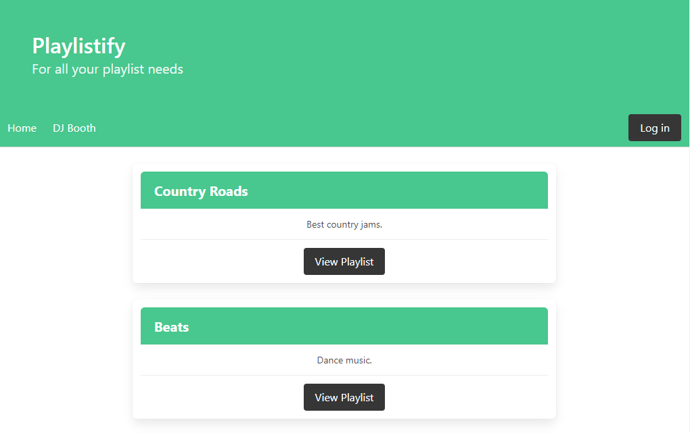

# Playlistify

# Description

This application utlizes the Spotify API in order to search song data and create individualized playlists. Users can log in using their existing Spotify credentials. Once logged in, users can create multiple playlists. On each playlist, users can search the Spotify database for songs based on keyword. Relevant song data is presented to the user who can choose to add each song to their playlist.

* [Deployed Application](https://playlistify-pod3.herokuapp.com/)

* [GitHub Repo](https://github.com/spreston4/playlistify)




# Ongoing Development

* Present more than 5 options to the user from search results
* Present song data to user - 'danceability index', 'beats per minute', etc.
* Add song to playlist

# Technologies Used

Built in Visual Stuio with:
* Node.js
* Express
* Express-Sessions
* Handlebars
* MySQL
* Sequelize
* Spotify API


## User Story
```
AS A a rising star in the DJ world
I WANT to build playlists based on 'dancability'
SO THAT I have quick access to different 'mood' music and create a memorable experience for party goers
```

## Dev Team

* Jason Ma: [JMagic-Learner](https://github.com/JMagic-Learner)
* Sam Nielsen: [sammn721](https://github.com/sammn721)
* Sam Preston: [spreston4](https://github.com/spreston4)
* Rob Simanton: [RSimer](https://github.com/RSimer)


